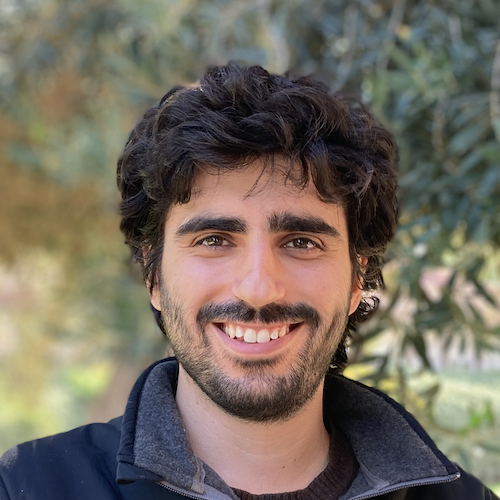

<!--   -->

<!-- trick from here
https://stackoverflow.com/questions/18032220/how-to-change-source-of-img-tag-on-hover -->
::: {layout="[20,30]" layout-valign="center"}

:::: image_here

::::

:::: name_here
# Erez Feuer

----

<!--  **Senior Lecturer**   -->
 **Institute of Environmental Sciences**  
  &nbsp; **The Hebrew University of Jerusalem**
::::

:::

## Contact
<i class="fas fa-envelope fa-fw fa-lg svv" aria-hidden="true"></i> &ensp; erez.feuer@mail.huji.ac.il   
<!-- <i class="fa-solid fa-phone fa-fw fa-lg svv"></i> -->
<!-- &ensp; +972 8 948 9386   -->
<i class="fas fa-map-marked-alt fa-fw fa-lg svv"></i> &ensp; Rehovot Campus, Lubell building, office 39. <a href="https://goo.gl/maps/DM62y5VXAxJ2" target="_blank">Map here</a>

## About

I am an environmental scientist studying how trees respond to heatwaves, drought, and other short-term climate extremes.My research centers on the analysis of ecological and climate time series. I use statistical modeling, machine learning, and dynamical systems to understand how trees grow under baseline conditions and how short-term climate extremes affect them. I work extensively with dendrometer and flux-tower data, tree-ring archives, and high-resolution climate datasets to understand resilience, legacy effects, and the mechanisms that shape tree function in a warming world.

## Short Bio

**2022–to date:** PhD, Institute of Environmental Sciences, The Hebrew University of Jerusalem  

**2022:** MSc in Plant Science, The Hebrew University of Jerusalem — *summa cum laude*  

**2020:** BSc in Plant Science, The Hebrew University of Jerusalem — *summa cum laude*  

**2017:** BFA in Jazz Performance, The New School of Jazz and Contemporary Music, NYC — *with honors*

---

Outside of research, I’m a trumpet player and longtime jazz musician. I grow *Nepenthes* (carnivorous plants) in a smart, self-built greenhouse, and I enjoy building and experimenting with microcontrollers, embedded electronics, and IoT systems.

**Seeking postdoc opportunities beginning fall 2027.**
I welcome conversations about potential projects and collaborations.

---

