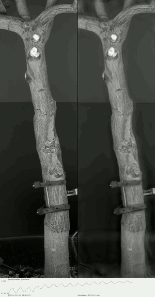

How does a changing climate alter the way trees grow, function, and survive? I study this question across timescales, from gradual shifts in average conditions to droughts, heat extremes, and their persistent effects. My work combines ecological and climate time-series analysis, statistical and machine-learning models, and dynamical-systems approaches, drawing on dendrometer records, flux-tower data, global tree-ring archives, and high-resolution climate datasets.

---

## Disentangling soil and atmospheric drought

Drought stress in trees can arise from both declining soil water availability and increasing atmospheric water demand. These two forms of drought act through different pathways but often occur together, making their effects difficult to separate.

In a semi-arid pine forest, I used high-resolution dendrometer measurements together with an irrigation experiment that relieved soil drought while leaving atmospheric conditions unchanged. This allowed me to separate the effects of atmospheric drought alone from those of combined atmospheric and soil drought on daily stem growth, contraction, and recovery. During periods of high atmospheric water demand, trees with sufficient soil water continued to grow, although at a reduced rate. When high atmospheric demand coincided with soil drought, growth stopped and stems instead contracted.

[Read the manuscript &#8594;](files/Feuer-etal-2025-PCE-tree-growth-drought.pdf){target="_blank" rel="noopener noreferrer"}

---

## Losses outlast gains: a century of tree growth under climate change

Under climate change, will forests grow more or less? Tree-growth responses vary across regions and climatic conditions, making them difficult to generalize. To trace these responses, we learned nonlinear climate–growth relationships from 4,110 Northern Hemisphere tree-ring chronologies recorded since 1902 — more than 12 million ring-width measurements — and projected them through the twenty-first century under CMIP6 climate scenarios.

Two findings stand out:

- Across the Northern Hemisphere, projected growth declines, driven by warming and rising atmospheric water demand whose negative effect outweighs the gains from changing precipitation.

- The response is asymmetric in time: once losses emerge they are rarely reversed, whereas gains tend to fade. The pattern holds in every well-sampled region and strengthens under stronger warming. This asymmetry reflects the nonlinear climate–growth response: warming can initially favor growth in colder, low-demand climates, but continued warming and rising atmospheric demand erode those gains.

[Read the manuscript &#8594;](files/Feuer-etal-losses-outlast-gains.pdf){target="_blank" rel="noopener noreferrer"}

---

## Drought history and tree survival under recurrent water stress

I am developing a low-dimensional dynamical model of tree drought recovery, building on carbon–hydraulic frameworks in which drought damage can impair water transport and alter carbon allocation during recovery. Rather than treating drought as a single perturbation followed by fixed recovery conditions, I am interested in how the system evolves under recurrent drought.

In this framework, drought changes the dynamics themselves: its intensity alters the phase space, its duration determines how long the tree evolves under those conditions, and its frequency determines how much recovery occurs before the next event. This makes it possible to ask how drought history shapes survival, and when sequences of individually survivable events can push a tree beyond the threshold for recovery.

---

## Where the tree-ring record can speak for a changing climate

The International Tree-Ring Data Bank is the largest archive of tree-ring records on Earth and a major resource for dendroclimatology. But its sites were assembled for many purposes, often to capture strong climate signals rather than to represent the full range of climates occupied by forests. This project quantifies how well the archive samples that multidimensional climate space, where coverage is dense or sparse, and how that coverage changes as the climate warms.

Three questions sit at its core:

- Climatic representation: how well does the tree-ring network represent the climates occupied by forests globally? I compare the distribution of tree-ring sites with global forest cover in multidimensional climate space, identifying where that space is well sampled and where important gaps remain.

- Space-for-time substitution: a common assumption in climate-change ecology is that spatial climate gradients can inform responses to change through time. I examine where the existing network provides suitable climatic analogs for this approach, and where that assumption becomes less well supported.

- Novel climates: as climate change shifts forests toward new combinations of conditions, some may move beyond the climate space represented in the existing record. Mapping these emerging gaps shows where inference becomes more uncertain and where additional sampling could be most valuable.

---

## Revealing whole-tree dynamics through time-lapse video

*Exploratory work — preliminary example.*

Can time-lapse video reveal otherwise invisible dynamics of the **whole tree**?
Dendrometers are widely used to track stem growth and shrinkage, but each sensor
measures changes at a single location. I am exploring whether time-lapse video
and motion amplification can extend these local observations to the whole tree,
revealing how the stem, branches, and canopy move together. By pairing video with
dendrometer measurements, I aim to connect these movements to tree water status
and environmental forcing. The preliminary example below focuses on the stem.

{width=320 fig-alt="Side-by-side time-lapse of a tree stem: original video on the left and amplified motion on the right, with a dendrometer diameter trace below." loading="lazy"}

---

## Future directions

Across these projects, my broader goal is to understand how climate alters the trajectories of trees and forests across timescales and spatial scales. I want to extend this work from growth and physiological responses to their consequences for tree survival, forest carbon dynamics, and ultimately forest–climate feedbacks.

An important direction for me is how multiple forms of stress and disturbance, including drought, heat, fire, and biotic agents, interact to shape forest responses to climate change. I want to pursue these questions across scales, from high-resolution measurements of individual trees to landscape and global analyses using remote sensing and large ecological datasets, combining measurement, theory, and modelling as the question demands.

I am seeking postdoctoral opportunities beginning fall 2027 to develop this research further.